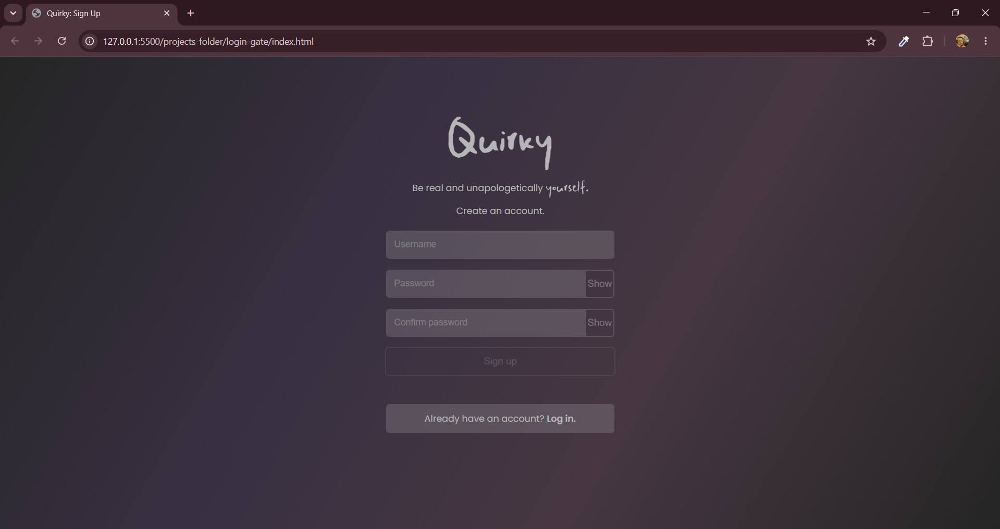
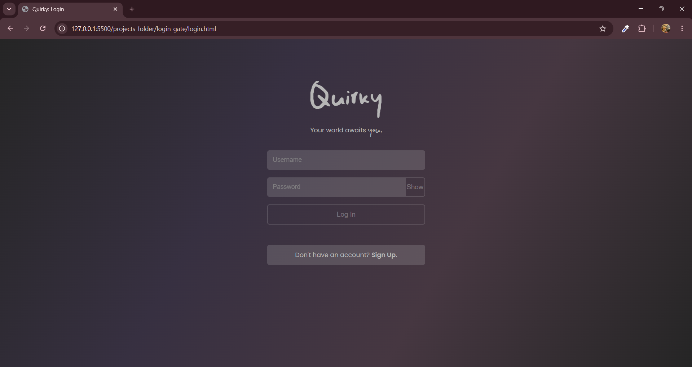
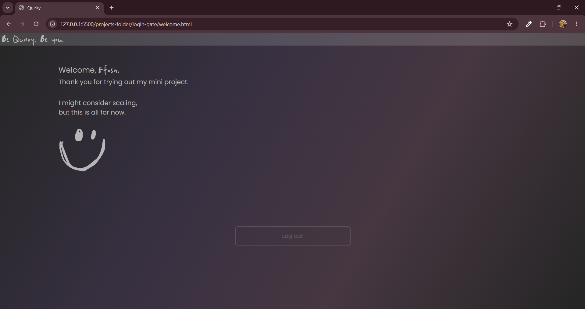

# Quirky — Mock Login Gate

A mini client-side login and sign-up experience built with HTML, CSS, and JavaScript.

This project was built as my second major JavaScript project, with the goal of moving from individual JavaScript exercises into building a small application where multiple concepts had to work together.

> **Note:** This is a learning project and is **not a production-ready authentication system**. User credentials are stored in the browser using `localStorage` and are not securely handled.

---

## 🌐 Live Demo

**Live site:** [Add link]

**Repository:** [the-quirkyEfosa/mock-login-gate](https://github.com/the-quirkyEfosa/mock-login-gate)

---

## 📸 Preview

  

---

## ✨ Features

* User sign-up
* Multiple-user storage
* Username uniqueness checking
* Password confirmation
* Password visibility toggle
* Login validation
* Persistent browser storage using `localStorage`
* JSON serialization and parsing
* Dynamic welcome message using the logged-in username
* Navigation back to the login page after use
* Responsive layout for smaller screens
* Custom typography and minimalist dark-themed interface

---

## 🛠️ Built With

* **HTML5** — page structure and forms
* **CSS3** — styling, layout, responsive design, gradients, custom fonts, and interaction states
* **JavaScript** — application logic, validation, DOM manipulation, events, and page flow
* **Web Storage API (****`localStorage`****)** — persistent client-side data storage
* **JSON** — converting JavaScript arrays and objects to strings for storage and back again

---

## 💡 About the Project

After project one, I knew I needed a multi-page project to better practicalize all I've learnt. And I thought, "A login gate has sign up and log in pages and it is essential to know how to create one as a web developer".

And I'm so glad that it served its purpose as project two.

I didn't really enter this project prepared to learn a number of specific new things. I just wanted to practicalize what I already knew.

Apparently, it was conceitful of me to assume I already knew enough to execute this project 😂.

It humbled me and then taught me a whole load of JS concepts I didn't know at all. Like `localStorage`, for example.

---

## 🎨 Design Decisions

### The "Quirky" Identity

I like the idea of odd but appealing. "Quirky" gives that idea a name.

I believe if people give "unconventional" a chance and don't shut it off at sight, it would be surprising how not-so-bad we begin to perceive it.

Provided "unconventional" doesn't defy common sense or go against morals.

Everyone should be able to freely pour out their inner essence without being criticised for it.

### Visual Style

The interface uses a dark, muted colour palette with a subtle gradient background. The design was intentionally kept minimalist rather than relying on a large number of visual elements.

I just love minimalist designs. It gives this feel of "beauty in simplicity" 😌.

### Typography

The project uses **Poppins** for the main interface text and a custom **Manic** font for selected headings and branding elements.

I would have used Manic everywhere if I could, but then my users wouldn't be able to see nothn 😂.

Manic, for me, helps convey that quirky feeling really well.

### Welcome Page

The welcome page was added to give the authentication flow a clear destination after successful login rather than ending immediately after authentication.

Well, truth be told, I just wanted the users to see their names written quirkily 😊.

---

## ⚙️ How It Works

### 1. Sign Up

A user enters a username, password, and password confirmation.

JavaScript checks that:

* Required fields have been filled.
* The password and confirmation match.
* The username has not already been registered.

A new user is represented as an object containing their username and password.

Users are stored together inside an array, allowing multiple accounts to exist.

The array is converted into a JSON string using `JSON.stringify()` before being stored in `localStorage`.

---

### 2. Login

When a user attempts to log in, the application retrieves the stored users from `localStorage` and converts the stored JSON back into JavaScript data using `JSON.parse()`.

The application then checks whether a user exists whose username and password match the submitted credentials.

If the credentials are valid, the username is stored as the latest logged-in user and the user is redirected to the welcome page.

---

### 3. Welcome Page

The welcome page retrieves the latest logged-in username from `localStorage` and displays it dynamically.

This allows information from the login process to be carried across to another HTML page.

---

## 🧠 What I Learned

This project introduced me to several concepts that were new or more practical than they had been in my earlier exercises.

### JavaScript

* Working with arrays of objects
* Using `.some()` to search through an array
* Creating and using functions
* DOM selection and manipulation
* Event listeners
* Form submission handling
* `preventDefault()`
* Conditional logic
* Input validation
* Changing element properties dynamically
* Working with multiple HTML pages from one JavaScript file

### JSON & localStorage

This one was completely impromptu learning. I had no idea I even needed them until I needed to log in after signing up 😭.

I learned that `localStorage` stores data as strings. This means JavaScript objects and arrays need to be converted into JSON strings before being stored, then parsed back into JavaScript data when retrieved.

### CSS

I also continued improving my CSS through:

* Flexbox
* Responsive layouts
* Media queries
* Gradients
* Custom fonts
* Form styling
* Hover, focus, and active states
* Creating a consistent visual identity across multiple pages

---

## 🧱 Challenges I Faced

1. **Getting my minimalist design to look more appealing than bleak.**

   It was a genuinely tough battle with CSS.

   * Getting the background gradient to look minimalist and not colourful
   * Maintaining the feel as much as I can while keeping design and accessibility in mind
   * Arranging flex items, especially the show-password buttons

2. **Multiple HTML pages, one JavaScript file.**

   It took me a lot of test-runs and failure to realize that I couldn't simply query and work with elements from all pages in the same way.

   Each HTML page has its own DOM, so elements that don't exist on the current page will return `null` when queried. Trying to use properties or methods on those missing elements can then throw an error and stop the remaining JavaScript execution.

   I was able to come up with a workaround where each page only executes the code that concerns it, using conditional statements.

3. **Displaying the user's name on the welcome page.**

   I want to believe there is a more efficient way to do that than storing the current user inside another array, but since it serves its purpose in this project, I'll leave it at that.

---

## 🔍 Lessons I'm Carrying Forward

Rather than going back and changing every decision I made in this project, I want to document the things I noticed and carry those lessons into future projects.

### Data Structure

I shouldn't have to create a whole array when all I need is just the current user who logs in at a time.

Since only one current user is needed, storing that username as a simple string would have been enough. I didn't understand that clearly when I built the project, so I'll treat it as a concept I need to improve on in a separate project.

### CSS

My stylesheet got really confusing even to me along the way. I'll work harder to maintain neatness as I write so as to save me unnecessary stress on bigger projects that need more lines of cascading.

### General Development

1. Structure and execution over beauty and features.
2. Curating a detailed workflow before a project so deviating every now and then to add features wouldn't be as easy.

---

## 🚧 Known Limitations

This project intentionally uses a simple client-side approach because its purpose was to practise JavaScript concepts.

So limitations include:

* User credentials are stored in `localStorage`.
* Passwords are not hashed or encrypted.
* There is no backend server.
* There is no database.
* There is no real session management.
* Authentication can be inspected or manipulated through the browser.
* Clearing the browser's stored data removes the saved users.
* The current "logout" flow only navigates back to the login page; it does not implement real session termination.

Because of these limitations, this project should **not** be used for real-world authentication or sensitive user information.

---

## 🔮 Future Improvements

If I were to continue developing this project, which I believe I will, I would:

* Introduce a backend authentication system
* Store user information in a database
* Implement secure password hashing
* Introduce proper session management
* Improve accessibility
* Strengthen form validation
* Add account management functionality
* Create a more complete authenticated user experience

These improvements would move the project beyond a client-side learning exercise into a more realistic authentication application.

---

## 🧪 What I'd Do Differently

I realized I replaced labels completely with placeholders, which was okay visually, but a very bad decision when it came down to accessibility.

I would endeavor to watch out for that next time.

---

## 🚀 Running the Project

### 1. Clone the repository

Clone or download the repository to your computer.

### 2. Open the project

Open the project folder in your code editor.

### 3. Run the project

Open `index.html` in a browser or use a local development server such as VS Code Live Server.

No external JavaScript frameworks or build tools are required.

---

## 👨🏾‍💻 What is This Project??

This project is part of my journey as a self-taught developer, where I'm learning by building increasingly complex projects rather than only studying concepts in isolation.

**Project 2 → Mock Login Gate**

---

## 📌 Final Reflection

Twas tuff, and twas worth it.

The fact that I am leaving this project with more theoretical and practical knowledge than when I picked it makes it a big success.

Ahead Ahead. ✊🏽💙
